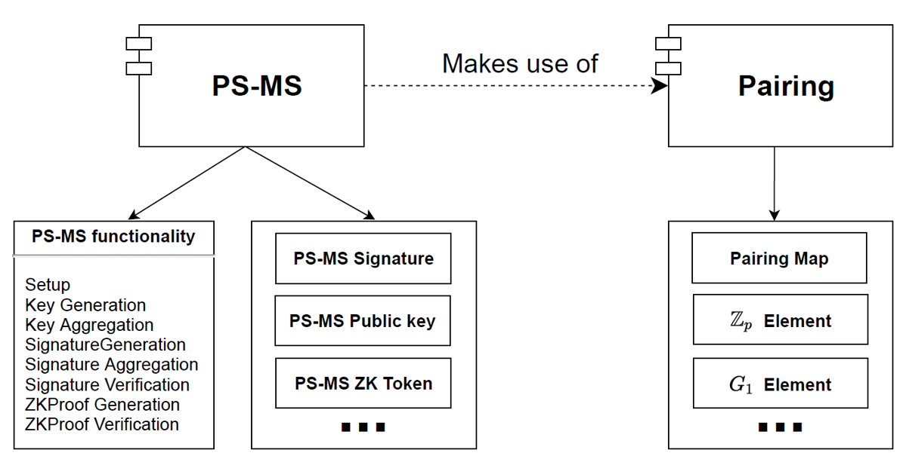

# PsmsLibrary

P-ABC library (distributed privacy-preserving Attribute-Based Credentials based on [PS multisignatures](https://eprint.iacr.org/2020/016)).

The current version of the project uses the [Miracle Core Library](https://github.com/miracl/core) Java implementation of EC arithmetic.

The library defines two main sets of interfaces: interfaces for a multi-signature scheme functionality and elements, and interfaces for a pairing-friendly elliptic curve functionality implementation (see Figure). The current implementations are based on the PS-MS scheme and the BLS12-461 curve.



## Instalation and build
The project is based on Maven. It is necessary to run 
```mvn clean```
to install the Miracl Core library into the local Maven repository. After that, you can test the implementation with 
```mvn test```
